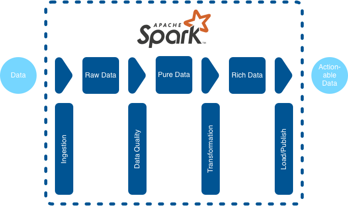
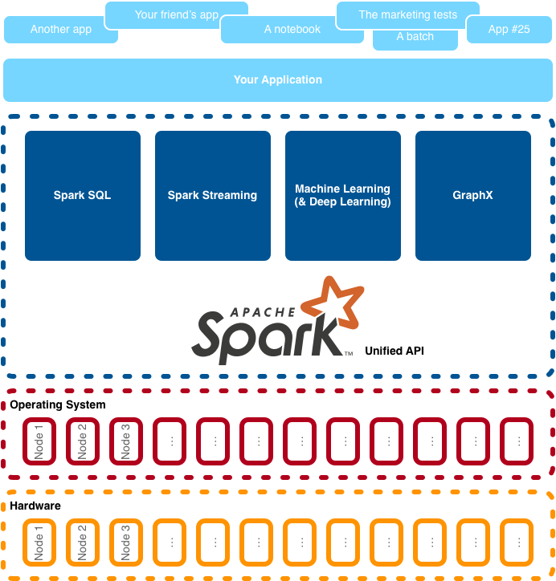

# Chapter 1 - So, what is Spark, anyway?

## 1.1 The big picture: what Spark is and what it does

### 1.1.1 What is Spark?

Spark is like an Analytics Operating System:
- provide a standard way to deal with data
- lower the cost of development (and maintenance) of applications,
- focus on understanding how to use the tool, not how the tool does it
- ...

### 1.1.2 How can you use Spark?
Typical Spark/Big Data scenario in four steps:
1. ingestion
2. data quality
3. transformation, 
4. publication

### 1.1.3 Spark in a data processing scenario
Spark excels when it plays in a Big Data scenario where you ingest data, clean them, transform them, and republish them. 

The process takes 4 steps:
1. Ingestion: Spark can ingest data from a variety of sources. If you can't find a supported format, you can build your 
own data source. The data is "raw data".
2. Data quality (DQ): before processing your data, you may want to check the quality of the data itself. E.g. ensure 
that all birth dates are in the past, or obfuscate (to anonymise) some data. Once the data is refined, the data is called
"pure data".
3. Transformation: the next step is to process your data: you can join it with other data sets, apply custom functions,
aggregations, machine learning, and more. The goal of this step is to get the rich data, fruit of your analytics work.
4. Load and Publish: as in a ETL (Extract, Transform, and Load) process, you can finish by loading the data in a
warehouse, a BI tool, calling APIs, saving in a file.

### 1.1.4 The four pillars of manna

Your application, as well as other applications, are talking to Spark's four pillars, SQL, streaming, machine learning,
graph via a unified API.

- Spark SQL offers API and SQL to manipulate your data. Spark SQL is a corner stone of Spark.
- Spark Streaming to analyse streaming data
- Machine learning and recent extensions in deep learning.
- GraphX to exploit graph data structures.

### 1.1.5 Spark in a data science scenario
